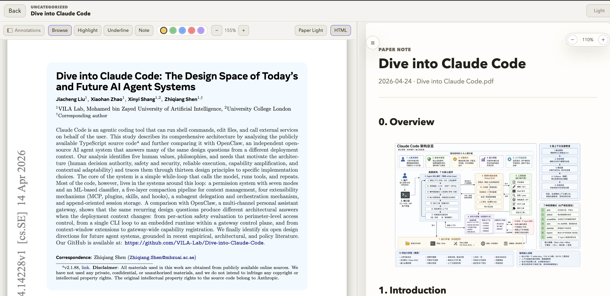
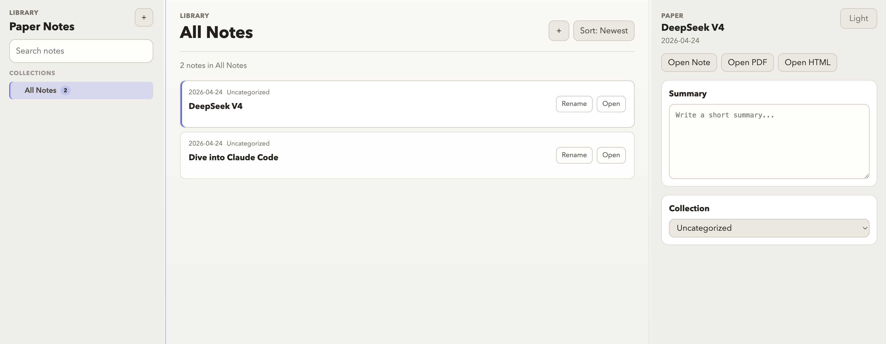

# Paper Notes

Paper Notes turns a folder of PDFs into a clean, local research workspace: read the paper on the left, build a beautiful HTML note on the right.

The HTML notes are designed to be generated or refined with an LLM, then kept as plain editable files you can version, customize, and reopen anytime.

## Preview

Paper Notes opens a PDF and its matching HTML note side by side:



The library view keeps imported papers, summaries, collections, and paper actions in one place:



## Quick Start

Recommended macOS setup: install the local background service once.

```bash
scripts/install-autostart.sh
```

Then bookmark and open:

```text
http://127.0.0.1:4173
```

After that, Paper Notes starts automatically when you log in. You can open the bookmark directly without running the local server manually.

Manual fallback:

```bash
uv run python src/paper_notes/server.py
```

Then open `http://localhost:4173`.

On macOS, you can also double-click `Open-Paper-Notes.command`.

The local server is required because the browser cannot write PDFs, HTML notes, annotations, or `notes.json` updates into this folder when `index.html` is opened directly.

To remove the background service:

```bash
scripts/uninstall-autostart.sh
```

## Import PDFs

1. Open `http://localhost:4173`.
2. Click the `+` button in the main toolbar.
3. Choose one or more PDF files.

For each imported PDF, the app creates:

- `resources/Papers/<same name>.pdf`
- `resources/Paper-html/<same name>.html`
- `resources/Paper-annotations/<note id>.json` after you create annotations
- one note entry in `notes.json`

These files are local workspace data and are ignored by Git. A fresh clone starts
with an empty library; importing PDFs recreates the folders as needed.

The generated HTML note starts with the paper title and metadata, then an empty note body:

```html
<section class="note-body"></section>
```

No default summary, fake sections, or placeholder text is inserted.

## Read And Edit Notes

Click a paper card or `Open Note` to open the split reader.

- Left pane: the PDF.
- Right pane: the rendered HTML note.
- Drag the middle divider to resize the PDF and note panes.
- The PDF pane and HTML note pane scroll independently on desktop.
- The PDF pane supports Zotero-style local annotations: highlights, underlines, and sticky notes.
- The PDF toolbar supports page number jumping, internal PDF links, larger zoom levels, undo/redo for annotation changes, and a temporary back button after PDF link jumps.
- Refresh the reader after editing `resources/Paper-html/<paper>.html`; the app reloads the latest HTML with caching disabled.

To edit a note, open the matching file in `resources/Paper-html/` and write normal HTML inside `.note-body`.

Example:

```html
<section class="note-body">
  <h2>Main Idea</h2>
  <p>Write your notes here.</p>

  <h2>Method</h2>
  <h3>Training Setup</h3>
  <p>Details...</p>
</section>
```

## PDF Annotations

The split reader uses PDF.js instead of the browser's read-only PDF iframe. Use the PDF toolbar to switch modes:

- `Browse`: normal reading and scrolling.
- `Highlight`: drag a rectangle on a PDF page to create a color highlight.
- `Underline`: drag across text to add a colored underline.
- `Note`: click a PDF page to add a sticky note.

Choose a color from the toolbar before creating an annotation. The annotation sidebar lists every annotation by page; click an item to jump back to its position, edit its comment, or delete it.

Annotations are saved as JSON files in `resources/Paper-annotations/`. The original PDF is not modified.

## Themes

Paper Notes uses a single app theme control in the library settings menu.

Theme choices are stored locally in the browser and do not change `notes.json`.

## Note Menu

HTML notes include a left-side contents menu. The menu is generated automatically from headings inside `.note-body`.

- `h2` becomes a top-level menu item.
- `h3` becomes an indented menu item.
- `h4` becomes a deeper indented menu item.
- A small floating menu button appears over the note without taking layout space.
- `h2`, `h3`, and `h4` sections can be collapsed from the heading.
- Clicking a menu item jumps to that section.
- If the note has no `h2`, `h3`, or `h4`, the menu button stays minimal and no placeholder text is shown.

This works both when opening the HTML file directly and inside the split reader.

## Images In Notes

Use normal relative paths when adding images to a note:

```html
<section class="note-body">
  <h2>Overview</h2>
  
</section>
```

When a note is rendered inside `reader.html`, root-relative image and media paths are served from `src/public/`.

## Library Actions

The library page supports:

- Importing PDFs with the `+` button.
- Opening a note, PDF, or HTML from the details panel.
- Renaming a paper from the paper card.
- Deleting a paper from the website list. This removes the note entry from `notes.json`; it does not delete the local PDF or HTML file.
- Writing a short summary in the details panel.
- Moving a paper between collections from the details panel.
- Creating, renaming, reordering, and deleting collections from the sidebar.

Renaming a paper updates `notes.json`. If the note HTML exists, the app also updates the HTML `<title>` and first `<h1>`.

Collection changes are also written back to `notes.json` when the local server is running, so a refresh keeps newly created collections, renamed collections, drag order, and paper moves.

## File Structure

```text
.
├── notes.json                 # Local library metadata, generated at runtime
├── package.json               # Frontend dependency metadata for PDF.js
├── pyproject.toml             # uv/Python project metadata
├── scripts/                   # macOS auto-start install/uninstall helpers
├── src/
│   ├── paper_notes/
│   │   └── server.py          # Python local server and file-writing API
│   └── public/
│       ├── index.html         # Library page
│       ├── reader.html        # Split PDF / HTML reader
│       ├── note-template.html # Manual note template
│       ├── scripts/           # Browser JavaScript
│       └── styles/            # CSS
├── assets/                    # Local image/media assets served at /assets
├── resources/                 # Local paper workspace data, ignored by Git
│   ├── Papers/                # Imported PDFs
│   ├── Paper-html/            # HTML note files
│   └── Paper-annotations/     # PDF highlight and sticky-note JSON files
```

## Development Notes

- The app has no build step.
- The local backend is Python and can be started with `uv run python src/paper_notes/server.py`.
- `npm start` is kept as a convenience wrapper for the same Python server.
- `scripts/install-autostart.sh` registers a macOS LaunchAgent named `com.paper-notes.local`.
- PDF rendering uses `pdfjs-dist`.
- Default port: `4173`.
- Static files are served with `Cache-Control: no-store` so note edits show up after refresh.
- `notes.json` and `resources/` are local user data and are ignored by Git.
- `.env`, `.venv/`, `.paper-notes-local/`, `node_modules/`, and temporary/cache folders are also ignored.

## License

MIT License. If you use or redistribute this project, keep the copyright and license notice.
