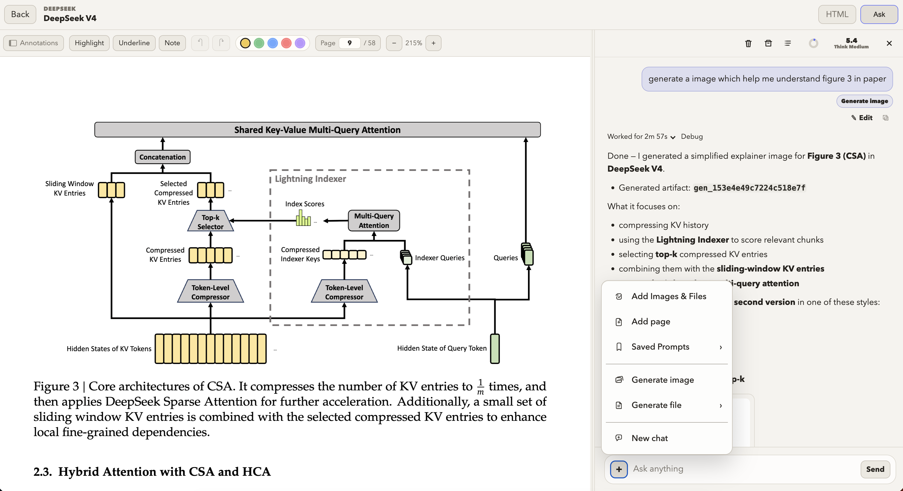
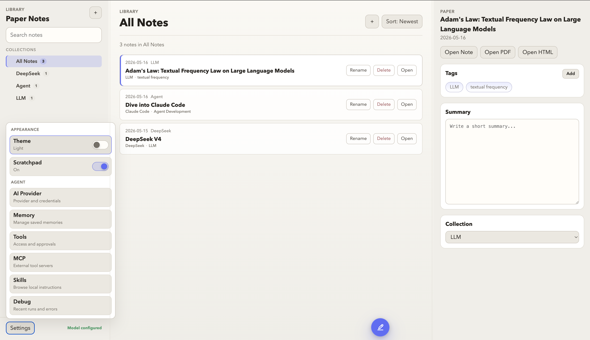

# Paper Notes

Paper Notes is a local research workspace for reading PDFs, annotating papers,
building HTML notes, and using an agent to work with your paper library.

The main reading view keeps the PDF on the left, the note on the right, and the
agent chat beside your work. Notes stay as normal HTML files that you can edit,
version, and move around without a hosted service.

## Preview

Paper Notes opens a PDF and its matching HTML note side by side:



The library view keeps imported papers, summaries, tags, collections, and paper
actions in one place:



## Requirements

- Python 3.12+ runtime.
- [uv](https://docs.astral.sh/uv/) used to install Python dependencies and run
  local commands.
- Node.js and npm, used to install browser dependencies such as PDF.js and
  KaTeX.

On macOS, install `uv`, Node.js, and npm with Homebrew:

```bash
brew install uv
brew install node
```

Or install them separately:

- `uv`: use the official installer:

  ```bash
  curl -LsSf https://astral.sh/uv/install.sh | sh
  ```

- Node.js/npm: install the LTS release from [nodejs.org](https://nodejs.org/).

Check that the commands are available:

```bash
uv --version
node --version
npm --version
```

After cloning, install the frontend dependencies once:

```bash
npm install
```

This creates `node_modules/` for browser packages, including PDF.js for PDF
rendering and KaTeX for math formulas in chat. It does not start the Paper
Notes server.

## Quick Start

Recommended setup: install the local background service once.

```bash
scripts/install-autostart.sh
```

The installer runs `npm install` for frontend browser packages when needed,
runs `uv sync`, creates `.venv`, then registers:

- macOS: a launchd LaunchAgent named `com.paper-notes.local`
- Linux: a user systemd service named `paper-notes.service`

On unsupported platforms, the script still prepares the Python environment and
prints the manual start command.

Open:

```text
http://127.0.0.1:4173
```

Manual fallback:

```bash
uv sync
uv run python main.py
```

Then open `http://127.0.0.1:4173`.

The local server is required because the browser cannot write PDFs, HTML notes,
annotations, generated media, sessions, settings, or `notes.json` updates when
`index.html` is opened directly.

## Docker Compose

Paper Notes can also run as a local Docker Compose app.

Use either the local background service or Docker Compose for a given checkout.
Do not run both at the same time, or they will compete for port `4173`.

Requirements:

- Docker Desktop or Docker Engine with the Compose plugin
- The repository checked out locally so Docker can mount your paper data

Before the first Docker start, create the bind-mounted runtime paths:

```bash
mkdir -p resources .paper-notes tmp
test -f notes.json || printf '{\n  "categories": [\n    {"id": "all", "name": "All Notes", "parentId": null, "order": 0, "system": true},\n    {"id": "uncategorized", "name": "Uncategorized", "parentId": null, "order": 1, "system": true}\n  ],\n  "notes": []\n}\n' > notes.json
```

Build and start:

```bash
docker compose up --build
```

Then open:

```text
http://127.0.0.1:4173
```

Stop the app:

```bash
docker compose down
```

Restart the app without rebuilding:

```bash
docker compose restart
```

View logs:

```bash
docker compose logs -f
```

The Compose setup keeps your local data on the host:

- `resources/`: imported PDFs, editable HTML notes, annotations, and caches
- `.paper-notes/`: local settings, sessions, logs, media, memory, and auth state
- `notes.json`: library metadata
- `tmp/`: local runtime logs and temporary output

To update after pulling new code:

```bash
docker compose up --build
```

To stop the container but keep your data:

```bash
docker compose down
```

To stop the container and remove the persisted local data for a fresh start:

```bash
docker compose down
rm -rf resources .paper-notes tmp
rm -f notes.json
```

Common Docker issues:

- A local autostart service is still running: stop it with `scripts/uninstall-autostart.sh` or unload the `com.paper-notes.local` LaunchAgent before starting Docker.
- Port `4173` already in use: stop the existing local Paper Notes process or change the published port in `docker-compose.yml`.
- Missing bind-mount paths: create `resources/`, `.paper-notes/`, `tmp/`, and `notes.json` before the first `docker compose up`.
- Permission errors on mounted folders: make sure your local user can read and write the repository runtime files.
- Container starts but the browser cannot connect: confirm Docker is running and that the service log says Paper Notes is listening on port `4173`.

To remove the background service:

```bash
scripts/uninstall-autostart.sh
```

To also remove the generated Python environment:

```bash
scripts/uninstall-autostart.sh --remove-venv
```

## Import PDFs

1. Open `http://127.0.0.1:4173`.
2. Click the `+` button in the library toolbar.
3. Choose one or more PDF files.

For each imported PDF, Paper Notes creates:

- `resources/Papers/<same name>.pdf`
- `resources/Paper-html/<same name>.html`
- `resources/Paper-annotations/<note id>.json` after annotations exist
- one note entry in `notes.json`

The generated HTML note starts with the paper title and metadata, then seeds
`.note-body` with the PDF outline when one is available. If the PDF has no
embedded outline, Paper Notes tries to infer common section headings from the
first pages.

No fake summary, placeholder prose, or default section text is inserted.

## Reader And Notes

Click a paper card or `Open Note` to open the split reader.

- Left pane: PDF.js paper reader.
- Middle pane: rendered HTML note.
- Right pane: agent chat.
- PDF and note panes scroll independently on desktop.
- The dividers resize the PDF, note, and chat panes.
- The PDF toolbar supports page jumping, zoom, internal PDF links, highlights,
  underlines, sticky notes, annotation undo/redo, and PDF text copy.
- Existing sticky note markers can be dragged to reposition them in any PDF
  annotation mode.
- HTML notes include an automatic contents menu from `h2`, `h3`, and `h4`
  headings inside `.note-body`.

To edit a note manually, open the matching file in `resources/Paper-html/` and
write normal HTML inside `.note-body`.

```html
<section class="note-body">
  <h2>Main Idea</h2>
  <p>Write your notes here.</p>

  <h2>Method</h2>
  <h3>Training Setup</h3>
  <p>Details...</p>
</section>
```

Refresh the reader after editing the file. Static files are served with
`Cache-Control: no-store`, so local note edits show up after refresh.

## PDF Annotations

The split reader uses PDF.js instead of the browser's read-only PDF iframe.
Use the PDF toolbar to switch modes:

- `Browse`: normal reading and scrolling.
- `Highlight`: drag across PDF text to create a color highlight.
- `Underline`: drag across text to add a colored underline.
- `Note`: click a PDF page to add a sticky note.

Existing sticky note markers can be dragged in any annotation mode. Annotation
undo/redo covers created, deleted, edited, and repositioned annotations.

Annotations are saved as JSON in `resources/Paper-annotations/`. The original
PDF is not modified.

## Agent Assistant

The Reader `Ask` panel is backed by the local agent runtime. It can use local
tools to search papers, read PDF text, inspect note HTML, render or extract PDF
images, review safe note edits, generate image/file artifacts, search past
sessions, maintain session todos, read/write curated memory, load skills, and
run bounded Python code.

AI provider setup lives in Settings > AI Provider:

- OpenAI API key mode stores local settings and secrets under `.paper-notes/`.
- Codex OAuth mode stores local OAuth state under `.paper-notes/auth/`.
- The model picker in the reader can override provider/model per session.

Tool settings live in Settings > Tools. Built-in tools are enabled by default
and currently default to full access unless you change the global or per-tool
mode. You can switch tools to ask, read-only, block, or disabled from the UI.

MCP settings live in Settings > MCP. Paper Notes acts as an MCP client/host:
enabled external MCP servers are connected at agent startup and their tools are
registered under the `MCP` tool group. The local config is stored in
`.paper-notes/mcp-servers.json`; Paper Notes writes it with `0600` file
permissions. Env/header values are stored as secret references in that config,
with the actual values kept in `.paper-notes/secrets.env`; API responses and the
UI only show configured redacted entries.

Minimal stdio example:

```json
{
  "servers": [{
    "id": "filesystem",
    "name": "Filesystem",
    "enabled": true,
    "transport": "stdio",
    "command": "npx",
    "args": ["-y", "@modelcontextprotocol/server-filesystem", "/path/to/folder"],
    "env": {},
    "timeoutSeconds": 120,
    "connectTimeoutSeconds": 10
  }]
}
```

Minimal Streamable HTTP example:

```json
{
  "servers": [{
    "id": "local_http_mcp",
    "name": "Local HTTP MCP",
    "enabled": true,
    "transport": "http",
    "url": "http://127.0.0.1:8000/mcp",
    "headers": { "Authorization": "Bearer <token>" },
    "timeoutSeconds": 120,
    "connectTimeoutSeconds": 10
  }]
}
```

Secrets can be entered as `env` for stdio servers or `headers` for HTTP
servers. You can optionally add `includeTools` and `excludeTools` arrays to a
server entry; values match original MCP tool names, support `*` wildcards, and
also apply to the utility names `list_resources`, `read_resource`,
`list_prompts`, and `get_prompt`.

Paper Notes also refreshes exposed tools after `tools/list_changed`, keeps
long-lived sessions alive with reconnect/circuit-breaker handling, exposes
read-only resource and prompt utility tools when advertised by the server, maps
MCP annotations such as read-only/destructive/idempotent/open-world hints into
tool metadata, and materializes MCP image, safe text-like, or PDF results as
local `source="mcp"` media artifacts. Settings > MCP shows runtime status, retry
timing, security warning counts, and read-only reconnect/reset/log actions.

Current MCP support is intentionally limited to external tools over stdio and
Streamable HTTP. SSE transport and MCP OAuth are out of scope for now;
sampling/createMessage, running Paper Notes itself as an MCP server, Office
artifactization, archives, and arbitrary binary artifactization are left for
later safety review.

Visible tool groups are ordered as:

1. Paper Notes
2. Native Web Search
3. Code Execution
4. Persistent Memory
5. Session Search
6. Todo
7. Skills
8. Custom Web Search
9. MCP, when at least one enabled MCP server exposes tools

The Debug link under a completed answer opens the saved run log for model
requests, tool calls, progress events, and work trace details. Tool activity
cards can show changed note files and support undo/redo for saved write
snapshots.

## Local Data

Paper Notes keeps user data local:

Core library data:

- `notes.json`: paper library metadata
- `resources/Papers/`: imported PDFs
- `resources/Paper-html/`: editable HTML notes
- `resources/Paper-annotations/`: PDF annotation JSON

Derived paper caches:

- `resources/Paper-text/`: extracted PDF text cache
- `resources/Paper-pages/`: rendered PDF page image cache
- `resources/Paper-images/`: extracted PDF image cache

Agent and app runtime state:

- `.paper-notes/sessions/`: chat sessions and transcripts
- `.paper-notes/compression/`: context compression checkpoints
- `.paper-notes/snapshots/`: write snapshots used for undo/redo
- `.paper-notes/approvals/`: local tool approval history
- `.paper-notes/logs/`: debug logs and tool result records
- `.paper-notes/memory/`: curated user/project memory
- `.paper-notes/media/`: uploads and generated artifacts
- `.paper-notes/skills/`: user-installed or user-authored skills
- `.paper-notes/mcp-servers.json`: local MCP server configuration
- `.paper-notes/tool-settings.json`: local tool permissions
- `.paper-notes/secrets.env` and `.paper-notes/auth/`: local provider secrets/auth

These runtime folders are ignored by Git.

## File Structure

```text
.
├── main.py                     # Local server entry point
├── notes.json                  # Local library metadata, generated at runtime
├── package.json                # Frontend scripts and PDF.js dependency
├── pyproject.toml              # Python runtime dependencies
├── scripts/                    # install/uninstall service helpers
├── src/
│   ├── agent_memory/           # Curated local memory
│   ├── agent_prompts/          # System prompt and context builder
│   ├── agent_runtime/          # Agent service, loop, runner, control
│   ├── agent_sessions/         # Chat session metadata and transcripts
│   ├── app_config/             # AI settings and local secrets
│   ├── app_infra/              # Paths, storage, shared formatting
│   ├── context_compression/    # Context pruning and summaries
│   ├── library/                # Library, note HTML, annotations
│   ├── media/                  # Upload and generated media store
│   ├── model_providers/        # OpenAI/Codex provider boundary
│   ├── skills/                 # Local Paper Notes skills
│   ├── telemetry/              # Progress, debug, and run records
│   ├── tool_safety/            # Approvals, guardrails, snapshots
│   ├── tools/                  # Tool registry and built-in tools
│   └── ui/
│       ├── backend/            # HTTP API and static server routes
│       └── frontend/
│           ├── index.html
│           ├── reader.html
│           ├── note-template.html
│           ├── scripts/
│           │   ├── reader/     # Reader, PDF, chat, debug modules
│           │   ├── site/       # Library page and settings modules
│           │   ├── shared/     # Shared browser helpers
│           │   └── note/       # Standalone note behavior
│           └── styles/
│               ├── reader/     # Reader CSS modules
│               └── site/       # Library/settings CSS modules
├── assets/                     # README/static image assets
└── resources/                  # Local paper workspace data, ignored by Git
```

## Development

Start the local server:

```bash
uv run python main.py
```

or:

```bash
npm start
```

Useful checks:

```bash
uv run --group dev pytest
npm run lint
npm run test:e2e
```

Focused syntax checks:

```bash
uv run python -m py_compile $(find src -name '*.py' -not -path '*/__pycache__/*') main.py
find src/ui/frontend/scripts -name '*.js' -print0 | xargs -0 -n1 node --check
```

Default port: `4173`.

## License

MIT License. If you use or redistribute this project, keep the copyright and
license notice.
